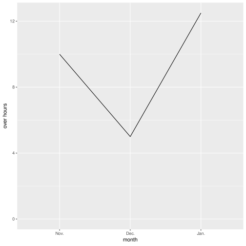
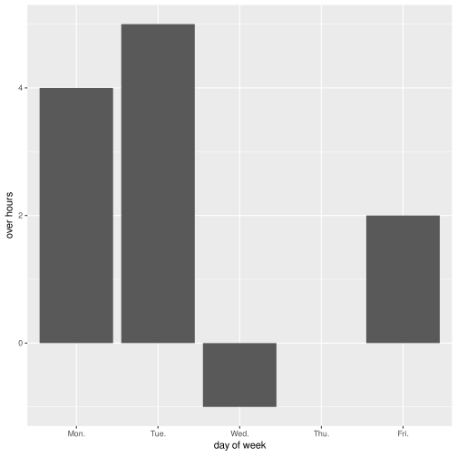

# overtime-checker

***Plot It, Black***

## Usage

### Calculate variable and fixed working hours

Edit the comments of [./src/overtime_checker/core.clj](./src/overtime_checker/core.clj) something like:

```clj
(def month (overtime "/path/to/working_time.tsv"))  ;; e.g., resources/*.tsv
(:variable-hour month)  ;; => 10.0
(:fixed-hour month)  ;; => 11.0
```

### Make the graph for months and day of weeks

Tweak the example codes of [./src/overtime_checker/graph.clj](./src/overtime_checker/graph.clj) . The following is an example of graphs.

#### month



#### day of week



## License

Copyright © 2021 r6eve
